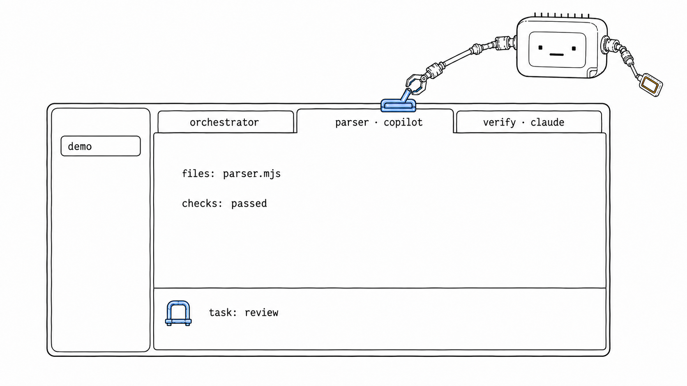
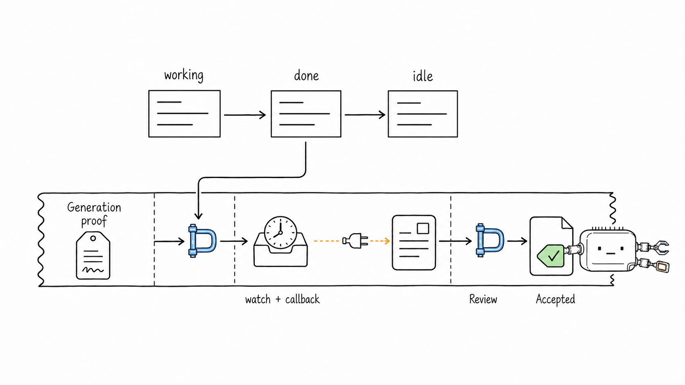
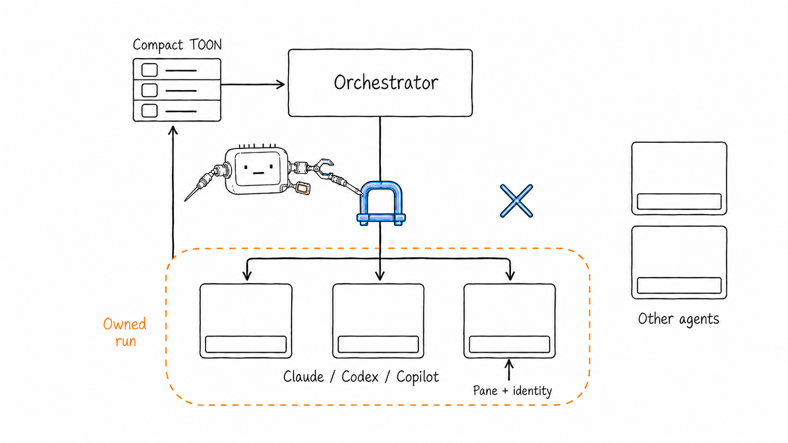
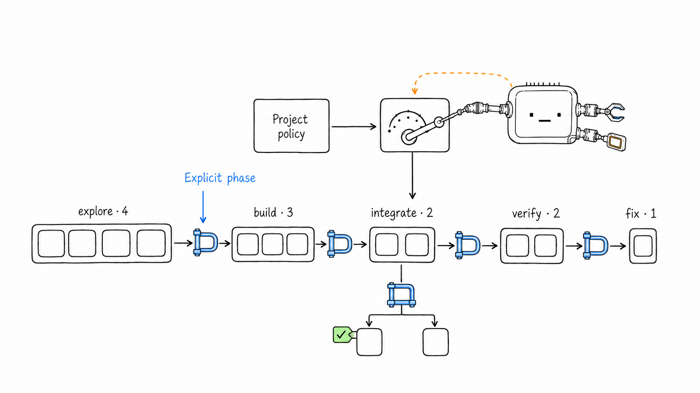
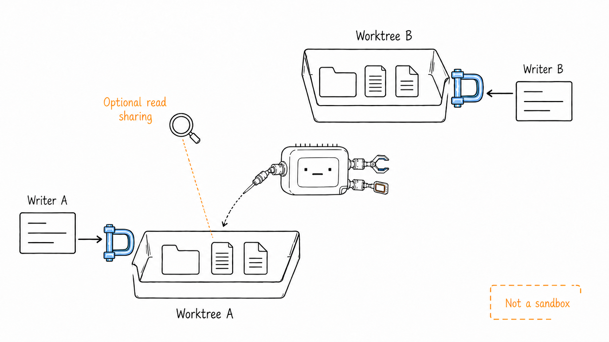
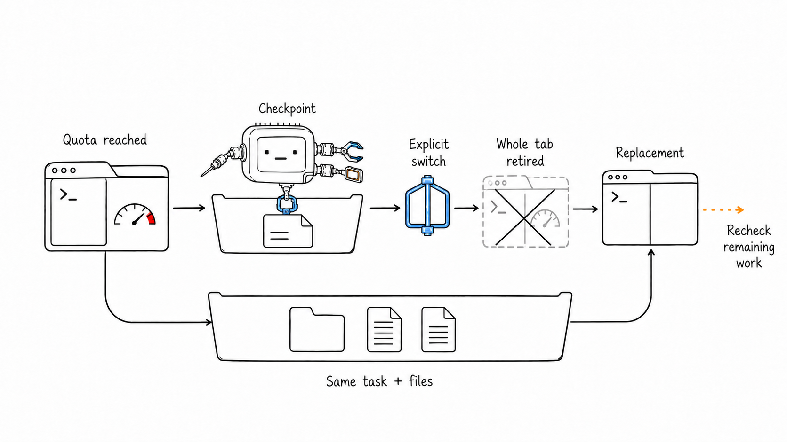
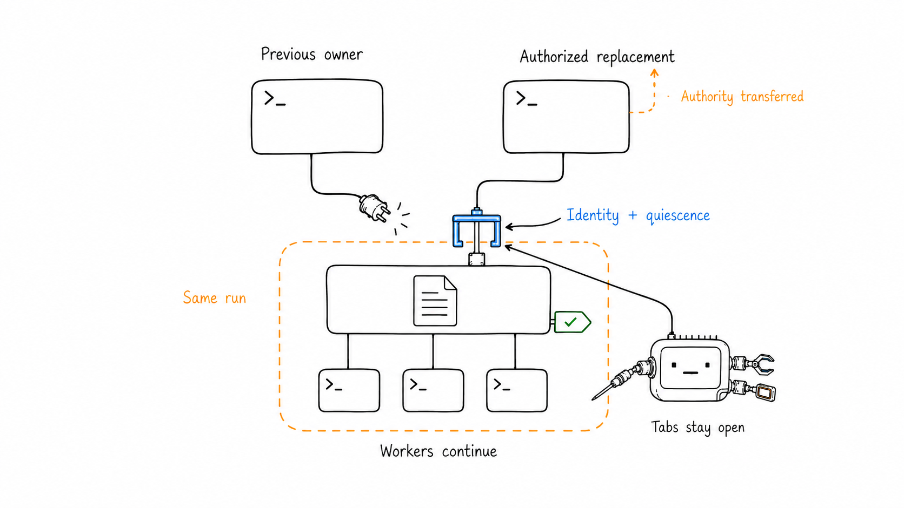
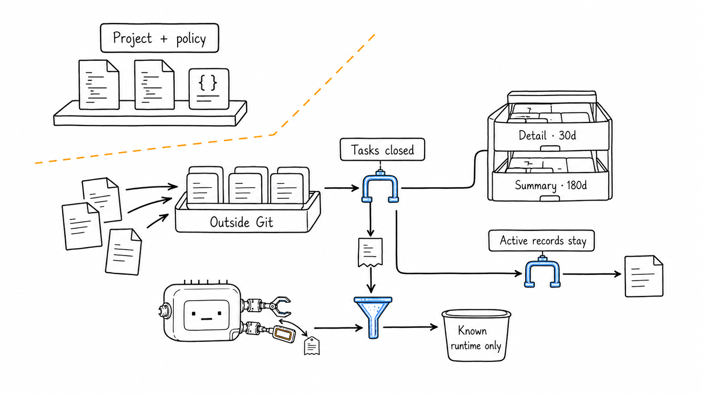

# herdr-axi

- Agent-facing CLI for Herdr terminal workspaces; one orchestrator; Claude, Codex and Copilot workers.
- Compact TOON; bounded concurrency; pane-safe control; recoverable handoffs.
- [Install](#setup) · [Delegate](#for-agents) · [Features](#features) · [Operator guide](docs/operator-guide.md) · [Live tests](LIVE-TEST.md)



- **Orchestrator tab:** delegate, review, accept; continue independent work.
- **Worker tabs:** `<task-id> · <kind>`; default 75% agent / 25% monitor.
- **Monitor `task: review`:** result ready for review, not yet accepted.
- Conceptual illustration; no live project data or terminal screenshot.

## Setup

| Who | Once |
| --- | --- |
| Human | Install [Herdr](https://herdr.dev); authenticate the worker CLIs you want to use |
| Machine | Node ≥20; Bash, `jq`, `rg`, `uuidgen`; Herdr and worker CLIs on inherited `PATH` |
| CLI | Clone, install dependencies, link the checkout globally |
| Project | Optional [`.herdr-axi.json`](.herdr-axi.json); defaults work without it |
| Orchestrator | Open the target project in Herdr; start your chosen coding agent in its own tab |

```sh
git clone https://github.com/jxn-cmd/herdr-axi.git
cd herdr-axi
npm ci
npm link
herdr-axi --version
```

- GitHub access required while the repository is private; no published npm install assumed.
- Preserve the global npm bin directory on every agent's `PATH`.
- Managed workers also receive the package bin path and `HERDR_AXI_BIN` fallback.
- No global Claude/Codex/Copilot instruction files modified.

- Human handoff — paste into your orchestrator:

```text
Task: <goal, scope and required checks>
Delegation: herdr-axi managed run; project roles; bounded phases.
Start: init -> returned export + queue --start. Optional help: guide "start opus".
Parallel writers: separate worktrees; no raw worker startup.
Waiting: independent work first; tracked watch only with verified wakeup.
Finish: reviewed results; owned worker tabs closed; run archived.
```

## For agents

- Run from **your own orchestrator pane**, in the target project.
- Optional help: `herdr-axi guide "start opus"`, `guide "quota switch"`, `guide "stop worker"`; precise TOON recipes, zero backend/model calls.
- Full compact workflow: `herdr-axi guide` / `herdr-axi --skill`; not a prerequisite.
- Start with `run init`; no fleet/config/layout preflight.
- Existing isolated worktree for concurrent writing; `--area` relative to `--cwd`, not isolation.
- Inline task + acceptance criteria + checks; no project plan/state document needed.

```sh
herdr-axi run init --project /path/to/project
export HERDR_AXI_RUN='/exact/path/returned/by/init'
herdr-axi run queue parser --role implementer \
  --cwd /path/to/separate-worktree --area src/parser \
  --prompt 'Fix parser edge cases; run parser tests; report files, checks and blockers.' --start
```

- Batch: omit `--start`, queue tasks, then `run next` once; `--start` starts all eligible queued tasks within caps.
- Two tool calls: `init`; then its returned export + `queue --start` together. Set `run phase build` when moving into implementation; no mandatory phase/config tour.
- Explicit worker choice: add `--kind claude --model claude-opus-5 --effort high`; role access/native limits retained; no config edit or new run.

| While workers run | Action |
| --- | --- |
| Independent work available | Continue it; no repeated status/inbox/read calls |
| Guaranteed background-job callback available | One tracked `herdr-axi watch`; handle its completion, then re-arm |
| Result now a dependency; no callback | Blocking `herdr-axi watch` |
| Another task awaits a decision | `watch --task TASK`; wait for independent work without resolving the other task |
| Watch returns a report | Review it directly; no extra inbox fetch |
| Insufficient evidence | Targeted `herdr-axi read <pane>` and inspect actual changes/checks |
| Accept / request fixes | `run accept <pane> --evidence "review and checks"` / `run revise <pane> --prompt "fix and recheck"` |
| Finish | `run close <pane>` for accepted workers; then `run finish` |

- **Hooks save receipts; they do not push into the orchestrator conversation.**
- Background wakeup requires a verified harness callback; detached `&` and a Herdr toast are not enough.
- Claude's native background Bash callback: [live-tested with Sonnet](LIVE-TEST.md#sonnet-orchestrators--7-september-2026); no universal wakeup claim.
- `watch` default: 30 seconds; `run watch` alias; one active watcher; timeout ≠ completion.
- Long wait: `watch --timeout-ms 1800000`; no model inference while blocked. File events + 2→10-second fallback checks; telemetry writes ignored.

<details>
<summary>Diagram: readiness, proof and acceptance</summary>



- `done → idle`: readiness only; valid generation proof stays reviewable.
- `unknown`, missing proof or uncertain delivery: no inferred completion.
- Only explicit coordinator review produces acceptance.

</details>

## Features

| Capability | Contract / entry point |
| --- | --- |
| Owned fleet | `fleet`, `agents`; selected run excludes self and foreign workers |
| Compact context | TOON, counts, bounded diagnostics, actionable pane-ID hints |
| Focused reads | `read`: 60 lines / 8000 characters; `--raw`: layout; `--full`: available history ≤2000 lines |
| Controlled dispatch | Managed tasks: `queue/next/revise`; authorized unmanaged panes: `dispatch`, `wait`; busy rejection; `--no-wait` means submission only |
| Phased scheduling | Explicit caps; accepted dependencies via `--after`; no batch barrier; matching workers reused |
| Worktree exclusion | One writer per canonical worktree across runs; queued relocation via `run move` |
| Model policy | Nearest project config → role defaults; explicit per-task model/effort; fixed autonomous launch modes |
| Manual-mode guard | Claude auto-capable model + visible Auto footer before submission; no bypass fallback |
| Native reviewers | Optional bounded read-only leaf subagents; separate budget; parent integrates |
| Context warnings | Defaults 70% / 85%; fresh readings actionable; unknown/stale disclosed; no auto-interrupt |
| Provider recovery | Explicit `run switch`; same task, dirty files, dependencies and reservation |
| Owner recovery | Authorized `run takeover`; same run; no automatic replacement launch |
| Stop + cleanup | Checkpointed `run cancel`; whole worker tab, including orphan monitor |
| Private history | `history`, `finish`, `gc`; evidence outside Git; selective retention |
| Fail loudly | Unknown flags rejected; exit 0 success / 1 error / 2 unknown command |

- Full commands, configuration, recovery cases and limits: [Operator guide](docs/operator-guide.md).
- Step-specific help: `herdr-axi run <action> --help`; full run reference: `herdr-axi run --help --full`.

<details>
<summary>Diagram: owned control, not global permission</summary>



- Address pane IDs, never terminal titles.
- Global discovery ≠ ownership; never dispatch to or close a merely listed agent.
- Owner, generation and topology checks before destructive control.

</details>

<details>
<summary>Diagram: broad exploration → focused fixes</summary>



| explore | build | integrate | verify | fix |
| ---: | ---: | ---: | ---: | ---: |
| 4 | 3 | 2 | 2 | 1 |

- Override: `run phase <phase> --cap N`, 1–16; ≤128 tasks/run.
- Blocked/lost/unaccepted tasks retain slots; narrowing never kills active work.
- Policy: [example](.herdr-axi.json); default native-child budget 4, separate from primary slots.
- Native child limits and read-only contracts: instructions, not OS enforcement.

</details>

<details>
<summary>Diagram: parallel writers without worktree collisions</summary>



- Separate canonical worktrees for parallel writers, even with disjoint `--area`.
- Readers reserve worktrees by default; optional `sharedReadWorktree` only within one run.
- Final verifier after accepted writer via `--after`; no sandbox claim.
- Busy worktree: continue independent work or `run move`; never close the blocking foreign pane.

</details>

## Recovery and cleanup

| Situation | Next step | Preserved |
| --- | --- | --- |
| Quota/session exhausted | `run switch <pane> --role <backup-role>`, then `run next` | Task, dirty worktree, bounded checkpoint, dependencies, reservation |
| Owner exhausted/absent | Authorized replacement: `run takeover --from <old-owner> --evidence "..."` | Run, tasks, receipts, leases; both owner tabs |
| Stop unfinished work | `run cancel <pane-or-task> --evidence "..."` | Partial evidence, files and native sessions; no fake acceptance |
| Startup dialog / uncertain send | Inspect; authorize UI input if appropriate; `run recover` | Identity and delivery state; no blind resend |
| Reservation / transaction recovery | `run leases` / terminal-task `run recover` / `run unlock` | Unknown ownership stays protected; unlock does not remove leases |
| Completed run | Close accepted workers; `run finish`; later `run gc` | Archived results and decision history |

<details>
<summary>Diagram: switch provider, preserve unfinished work</summary>



- No automatic billing/provider change; no complete model-context restoration.
- Completion proof takes precedence over quota; review finished work instead of switching.
- Interrupted switch: resume `run switch <task>`; `--cancel` only while the original worker remains verifiable.

</details>

<details>
<summary>Diagram: replace the orchestrator, not the run</summary>



- Same workspace, separate authorized owner tab; select the original `HERDR_AXI_RUN`.
- Active controls block takeover; previous owner loses CLI authority.
- Neither owner tab closes; no automatic owner launch or universal app wakeup.

</details>

<details>
<summary>Diagram: history without merged state-file clutter</summary>



- State: `~/.local/state/herdr-axi/`; configurable via `HERDR_AXI_STATE_HOME`.
- Default retention: managed detail 30 days; summaries 180 days.
- Active/locked runs, unknown files and explicit `--dir` records: no automatic age deletion.
- Close/cancel tabs **before** removing external worktrees; no forced Git cleanup.
- Native sessions and detached jobs untouched; inspect jobs before overlapping work.

</details>

## Verify

```sh
npm test
bash engine/test-herdr-monitor.sh
```

- Isolated fake backends; never drive the live fleet; process-identity tests need `ps`.
- [Live evidence and limits](LIVE-TEST.md) · [Operator guide](docs/operator-guide.md) · [Figure prompts and captions](assets/readme-figures/).
- Built with [axi-sdk-js](https://github.com/kunchenguid/axi) · [MIT](LICENSE).
